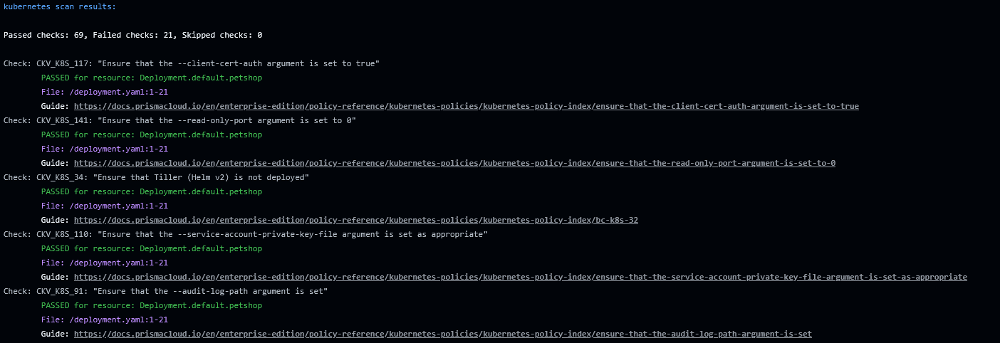
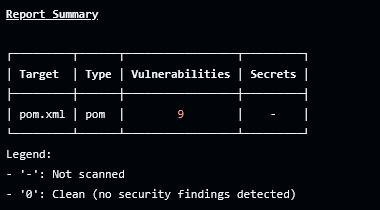
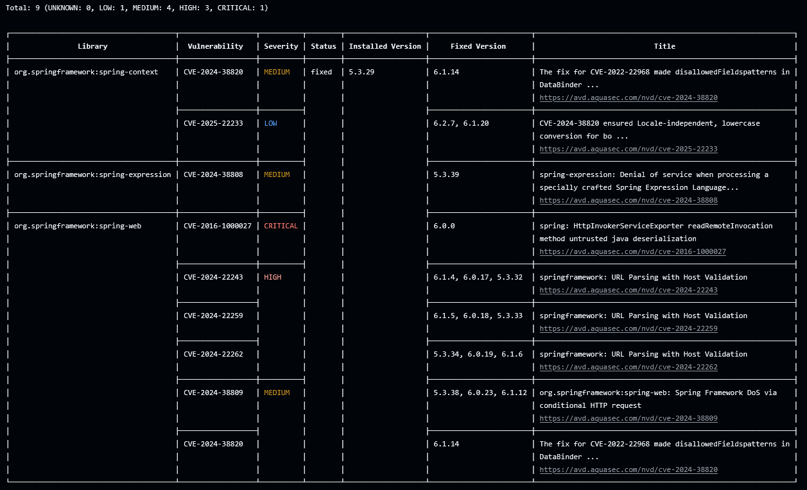
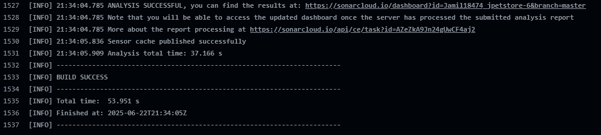
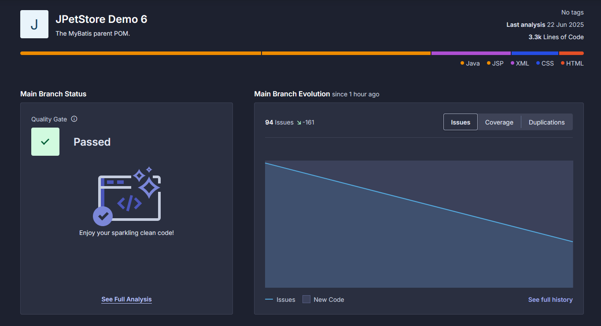
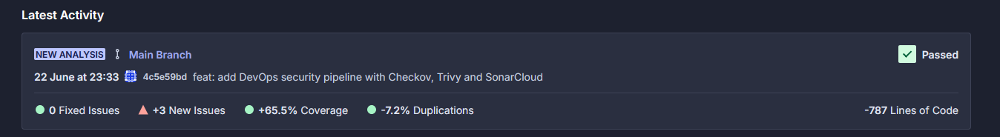
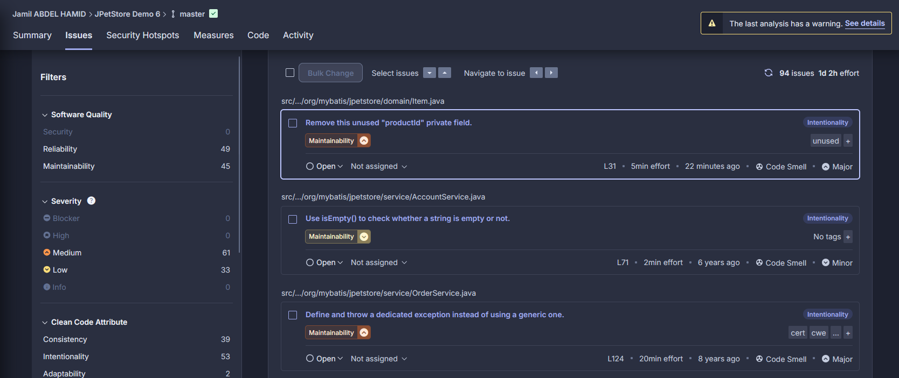

# Pipeline DevOps 

Un pipeline DevOps complet intégrant l'analyse de sécurité et la qualité du code pour une intégration et déploiement continus.
J'ai utilisé Github Actions car je l'utilise souvent et que c'est pratique à intégrer vu que j'utilise un dépôt git.
Je n'ai pas eu besoin d'installer des extensions d'IDE.


## Prérequis

Docker [Docker](https://www.docker.com/)

Checkov  [Checkov](https://www.checkov.io/)  

Trivy  [Trivy](https://trivy.dev/)  

Sonarcloud  [SonarCloud](https://sonarcloud.io/)

## 📊 Résultats et Rapports

### Résultats Checkov
- Problèmes de sécurité d'infrastructure
- Violations des bonnes pratiques

On utilise docker pour lancer le scan Checkov.

```yaml
jobs:
  checkov:
    name: IaC Scan with Checkov
    runs-on: ubuntu-latest
    steps:
      - uses: actions/checkout@v3

      - name: Run Checkov using Docker
        run: |
          docker run --tty --volume "$(pwd):/scan" bridgecrew/checkov -d /scan --soft-fail
```



### Résultats Trivy
- Vulnérabilités connues
- Problèmes de dépendances

On utilise docker pour lancer le scan Trivy.

```yaml
  trivy:
    name: Code Scan with Trivy
    runs-on: ubuntu-latest
    steps:
      - uses: actions/checkout@v3

      - name: Run Trivy using Docker
        run: |
          docker run --tty --volume "$(pwd):/scan" aquasec/trivy fs /scan
```

On a le rapport de synthèse des résultats.



On a le rapport détaillé des résultats.



### Résultats SonarCloud
- Métriques de qualité du code
- Rapports de couverture de tests

Il faut d'abord créer un projet sur SonarCloud à partir du dépôt git et on récupère les informations du projet : donc le projectkey du projet et l'organization, on récupère également le token de SONARCLOUD et on crée un token personnel classique de Github et on les met en secret dans le repo GitHub.

```yaml
  sonarcloud:
    name: SonarCloud Analysis
    if: github.repository_owner == 'jamil18474'
    runs-on: ubuntu-latest
    steps:
      - uses: actions/checkout@v3
        with:
          fetch-depth: 0

      - name: Set up JDK
        uses: actions/setup-java@v3
        with:
          java-version: 17
          distribution: zulu

      - name: Analyze with SonarCloud
        run: |
          ./mvnw verify -Dlicense.skip=true --no-transfer-progress || true
          ./mvnw jacoco:report
          ./mvnw sonar:sonar -B -Dsonar.projectKey=Jamil18474_jpetstore-6 -Dsonar.organization=jamil18474 -Dsonar.host.url=https://sonarcloud.io -Dsonar.login=$SONAR_TOKEN
        env:
          GITHUB_TOKEN: ${{ secrets.PERSONAL_GITHUB_TOKEN }}
          SONAR_TOKEN: ${{ secrets.SONAR_TOKEN }}
```

On remarque que sur Github Actions, le job de SonarCloud a été un succès et disponible sur le tableau de bord de SonarCloud



On voit le tableau de bord du projet sur SonarCloud avec le Quality Gate qui est bien passé.



On remarque qu'on a 3 nouveaux issues.



On a les issues du projet avec des filtres spécifiques.



## 🚀 Fonctionnalités

- **🔒 Sécurité Infrastructure as Code** - Scan Checkov
- **🛡️ Détection de Vulnérabilités** - Scan de sécurité Trivy
- **📊 Analyse Qualité du Code** - Intégration SonarCloud